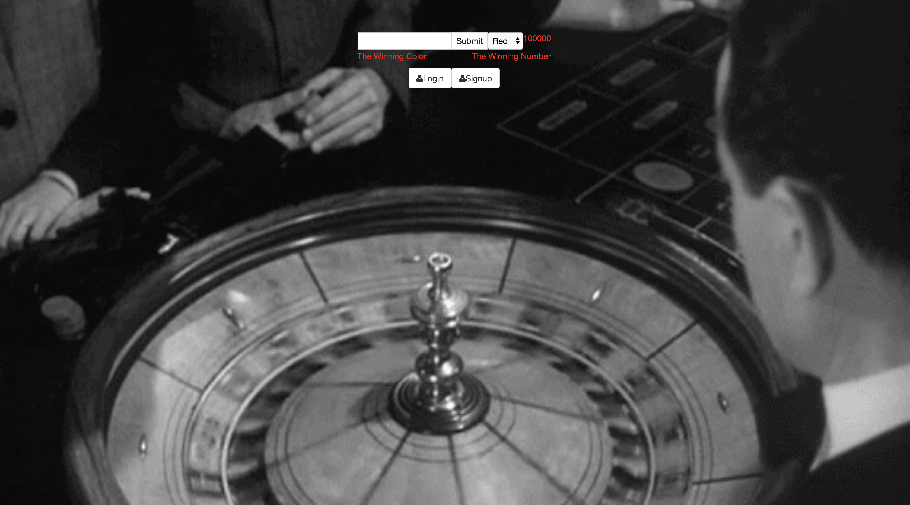

# Roulette w/Casino Login

The market needed another gambling platform so we've delivered. Play Roulette and the house can keep track of its profits

## How It's Made:

## Tech Used: HTML , CSS , JS , Node, MongoDB , Express

This project combines a simple layout built out with HTML & CSS with JS and Node/MongoDB as it's backbone. The casinos win/losses are tracked and retrieved from the database

## Lessons Learned

This project tested my ability to retrieve information from a database and display it on the DOM. Along with delivering JS logic that would permitt the game to work properly.

## Link to Other Works:

https://github.com/zikrehaimanot/serverToDoList

https://github.com/zikrehaimanot/potter

https://github.com/zikrehaimanot/UserLoginFullStack

https://github.com/zikrehaimanot/baristaApp
